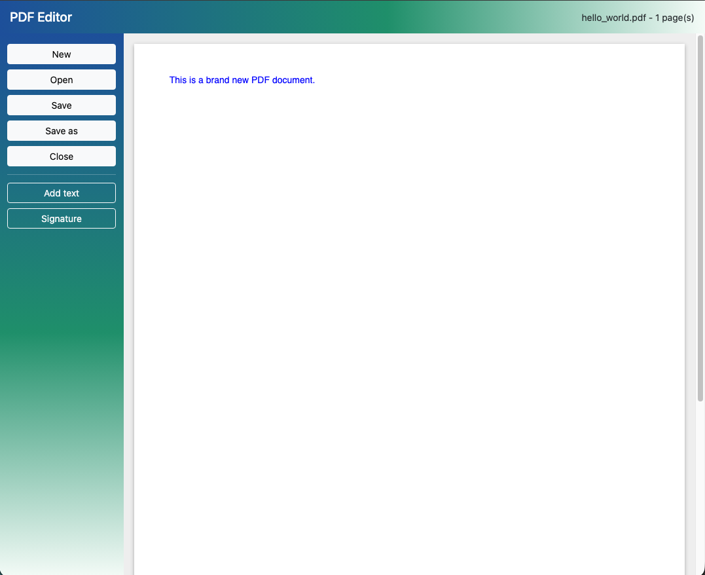

# PROOFREAD - PDF Editor

A small browser-based PDF editor. Open a PDF, place text fields on its pages, and save a new PDF with the text included.

Rendering uses [PDF.js](https://mozilla.github.io/pdf.js/), and saving uses [pdf-lib](https://pdf-lib.js.org/). Both load from a CDN.



## Features

- Create a new blank A4 document, or open and view PDF files
- Add text fields by clicking or dragging. Move, resize, edit, and delete them.
- Double-click the document's own text, even in PDFs without form fields, to edit it in place. Neighboring text on the same line with the same font, size, and color is edited as one piece, even if the PDF draws it letter by letter or word by word. Press Enter to apply or Escape to cancel. The text is changed in the PDF itself (via [PDFium](https://pdfium.googlesource.com/pdfium/) WebAssembly, loaded on the first edit). If the embedded font lacks a typed character, the text switches to the closest standard font.
- Text options: color, fill (or transparent), font size, font family (Helvetica, Times, Courier), bold, and italic
- Draw a signature, then drag it onto a page. It has a transparent background, and you can move, resize, recolor, and delete it.
- Save changes to the same file, or Save as a new PDF. Text fields and signatures stay editable when you open the saved file in this editor again.
- Close the document. If there are unsaved changes, the editor asks whether to save them first (also when you choose New or Open). Save overwrites the opened file in browsers that support the File System Access API (otherwise it works like Save as).

## Usage

```sh
npm install
npm start        # serves on http://localhost:8765
```

Then open http://localhost:8765 in a browser.

## Tests

End-to-end tests use Playwright:

```sh
npm test
```

## License

[PolyForm Noncommercial 1.0.0](LICENSE). This project is free for personal, educational, research, and other noncommercial use. Commercial use requires a separate license from the author.
